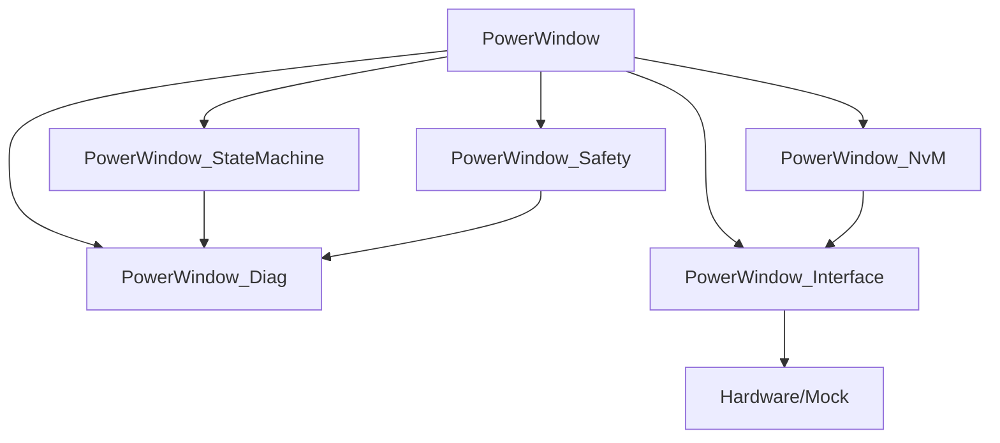
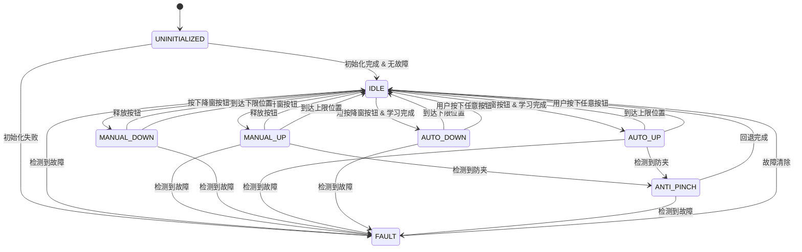

# 设计文档

## 概述

Power Window Anti-Pinch Controller 是一个符合 AUTOSAR 架构风格的嵌入式应用层软件（ASW），使用 C 语言实现。系统采用模块化设计，通过周期性主函数（10ms）驱动车窗控制逻辑，实现手动/自动升降、防夹保护、故障诊断、非易失性存储等功能。

### 设计目标

- 模块化架构：清晰的职责划分，低耦合高内聚
- 可测试性：通过 mock 接口实现硬件抽象，支持单元测试
- 可配置性：标定参数支持不同车型的适配
- 可维护性：.h/.c 分离，统一的命名规范和代码风格
- 安全性：防夹保护、故障检测、欠压保护等安全机制

### 技术栈

- 编程语言：C99
- 架构风格：AUTOSAR ASW/SWC
- 周期任务：10ms Runnable
- 测试框架：Unity（单元测试）+ 自定义 mock 框架

## 架构设计

### 模块划分

系统划分为 6 个功能模块，每个模块职责单一，通过明确定义的接口进行交互：

```
PowerWindow (主控模块)
├── PowerWindow_StateMachine (状态机模块)
├── PowerWindow_Safety (安全监控模块)
├── PowerWindow_NvM (非易失性存储模块)
├── PowerWindow_Diag (诊断模块)
└── PowerWindow_Interface (硬件接口抽象模块)
```

#### 1. PowerWindow (主控模块)

- 职责：系统初始化、周期性主函数、模块协调、输入处理、输出控制
- 文件：`PowerWindow.h`, `PowerWindow.c`
- 核心函数：
  - `PowerWindow_Init()`: 系统初始化
  - `PowerWindow_MainFunction_10ms()`: 10ms 周期主函数
  - `PowerWindow_ProcessInput()`: 处理按钮输入
  - `PowerWindow_UpdateOutput()`: 更新电机输出

#### 2. PowerWindow_StateMachine (状态机模块)

- 职责：管理车窗运行状态、状态转换逻辑、状态转换事件记录
- 文件：`PowerWindow_StateMachine.h`, `PowerWindow_StateMachine.c`
- 核心函数：
  - `PowerWindow_StateMachine_Init()`: 状态机初始化
  - `PowerWindow_StateMachine_Update()`: 状态机更新
  - `PowerWindow_StateMachine_GetState()`: 获取当前状态
  - `PowerWindow_StateMachine_RequestTransition()`: 请求状态转换

#### 3. PowerWindow_Safety (安全监控模块)

- 职责：防夹检测、电流监测、电压监测、故障检测
- 文件：`PowerWindow_Safety.h`, `PowerWindow_Safety.c`
- 核心函数：
  - `PowerWindow_Safety_Init()`: 安全模块初始化
  - `PowerWindow_Safety_MonitorAntiPinch()`: 防夹监测
  - `PowerWindow_Safety_MonitorCurrent()`: 电流监测
  - `PowerWindow_Safety_MonitorVoltage()`: 电压监测
  - `PowerWindow_Safety_CheckFaults()`: 故障检查

#### 4. PowerWindow_NvM (非易失性存储模块)

- 职责：数据持久化、数据恢复、存储管理
- 文件：`PowerWindow_NvM.h`, `PowerWindow_NvM.c`
- 核心函数：
  - `PowerWindow_NvM_Init()`: NvM 模块初始化
  - `PowerWindow_NvM_LoadData()`: 加载数据
  - `PowerWindow_NvM_SaveData()`: 保存数据
  - `PowerWindow_NvM_GetStatus()`: 获取存储状态

#### 5. PowerWindow_Diag (诊断模块)

- 职责：故障码管理、诊断数据提供、诊断命令处理
- 文件：`PowerWindow_Diag.h`, `PowerWindow_Diag.c`
- 核心函数：
  - `PowerWindow_Diag_Init()`: 诊断模块初始化
  - `PowerWindow_Diag_SetDTC()`: 设置故障码
  - `PowerWindow_Diag_ClearDTC()`: 清除故障码
  - `PowerWindow_Diag_GetActiveDTCs()`: 获取活动故障码
  - `PowerWindow_Diag_GetHistoryDTCs()`: 获取历史故障码

#### 6. PowerWindow_Interface (硬件接口抽象模块)

- 职责：硬件输入输出抽象、mock 接口实现
- 文件：`PowerWindow_Interface.h`, `PowerWindow_Interface.c`
- 核心函数：
  - `PowerWindow_Interface_Init()`: 接口模块初始化
  - `PowerWindow_Interface_ReadButton()`: 读取按钮状态
  - `PowerWindow_Interface_ReadPosition()`: 读取位置传感器
  - `PowerWindow_Interface_ReadCurrent()`: 读取电流传感器
  - `PowerWindow_Interface_ReadVoltage()`: 读取电压
  - `PowerWindow_Interface_SetMotor()`: 设置电机输出

### 模块依赖关系



依赖规则：
- PowerWindow 主控模块依赖所有其他模块
- StateMachine、Safety 模块通过 Diag 模块记录事件
- NvM 模块通过 Interface 模块访问存储硬件
- Interface 模块是唯一与硬件交互的模块
- 无循环依赖

### 执行流程

PowerWindow_MainFunction_10ms() 的执行顺序：

```
1. 读取输入 (Interface)
   ├── 读取按钮状态
   ├── 读取位置传感器
   ├── 读取电流传感器
   └── 读取电压

2. 安全监控 (Safety)
   ├── 防夹检测
   ├── 电流监测
   ├── 电压监测
   └── 故障检查

3. 状态机更新 (StateMachine)
   ├── 处理输入事件
   ├── 执行状态转换
   └── 记录状态变化

4. 输出控制 (PowerWindow)
   ├── 根据状态计算电机输出
   ├── 更新位置信息
   └── 设置电机驱动

5. 诊断更新 (Diag)
   └── 更新诊断数据

6. 数据保存 (NvM)
   └── 条件触发时保存数据
```

## 组件和接口

### 数据类型定义

所有数据类型定义在 `PowerWindow_Types.h` 中：

```c
/* 基础类型定义 */
typedef uint8_t  PowerWindow_StateType;
typedef uint16_t PowerWindow_PositionType;  /* 0-4095 */
typedef uint8_t  PowerWindow_PercentType;   /* 0-100 */
typedef uint16_t PowerWindow_CurrentType;   /* 单位: 0.1A */
typedef uint16_t PowerWindow_VoltageType;   /* 单位: 0.1V */
typedef uint16_t PowerWindow_DTCType;
typedef uint8_t  PowerWindow_BoolType;

/* 按钮状态枚举 */
typedef enum {
    POWERWINDOW_BUTTON_RELEASED = 0,
    POWERWINDOW_BUTTON_UP       = 1,
    POWERWINDOW_BUTTON_DOWN     = 2
} PowerWindow_ButtonStateType;

/* 电机方向枚举 */
typedef enum {
    POWERWINDOW_MOTOR_STOP = 0,
    POWERWINDOW_MOTOR_UP   = 1,
    POWERWINDOW_MOTOR_DOWN = 2
} PowerWindow_MotorDirectionType;

/* 系统状态枚举 */
typedef enum {
    POWERWINDOW_STATE_UNINITIALIZED = 0,
    POWERWINDOW_STATE_IDLE          = 1,
    POWERWINDOW_STATE_MANUAL_UP     = 2,
    POWERWINDOW_STATE_MANUAL_DOWN   = 3,
    POWERWINDOW_STATE_AUTO_UP       = 4,
    POWERWINDOW_STATE_AUTO_DOWN     = 5,
    POWERWINDOW_STATE_ANTI_PINCH    = 6,
    POWERWINDOW_STATE_FAULT         = 7
} PowerWindow_SystemStateType;

/* 故障码定义 */
typedef enum {
    POWERWINDOW_DTC_NO_FAULT           = 0x0000,
    POWERWINDOW_DTC_POSITION_SENSOR    = 0x0001,
    POWERWINDOW_DTC_OVERCURRENT        = 0x0002,
    POWERWINDOW_DTC_UNDERCURRENT       = 0x0003,
    POWERWINDOW_DTC_UNDERVOLTAGE       = 0x0004,
    POWERWINDOW_DTC_NVM_READ_FAIL      = 0x0005,
    POWERWINDOW_DTC_NVM_WRITE_FAIL     = 0x0006,
    POWERWINDOW_DTC_CALIBRATION_ERROR  = 0x0007
} PowerWindow_DTCCodeType;

/* 学习状态枚举 */
typedef enum {
    POWERWINDOW_LEARN_NOT_STARTED = 0,
    POWERWINDOW_LEARN_IN_PROGRESS = 1,
    POWERWINDOW_LEARN_COMPLETED   = 2,
    POWERWINDOW_LEARN_FAILED      = 3
} PowerWindow_LearnStateType;

/* 标定参数结构体 */
typedef struct {
    PowerWindow_CurrentType antiPinchCurrentThreshold;  /* 防夹电流阈值 (5A-20A) */
    PowerWindow_PositionType antiPinchRetractDistance;  /* 防夹回退距离 (50mm-200mm) */
    PowerWindow_PositionType positionUpperLimit;        /* 位置上限 (0-4095) */
    PowerWindow_PositionType positionLowerLimit;        /* 位置下限 (0-4095) */
    PowerWindow_VoltageType undervoltageThreshold;      /* 欠压阈值 (9V-11V) */
    PowerWindow_CurrentType overcurrentThreshold;       /* 过流阈值 (15A-30A) */
    uint16_t autoModeTriggerTime;                       /* 自动模式触发时间 (300ms-1000ms) */
} PowerWindow_CalibrationParamsType;

/* 运行时数据结构体 */
typedef struct {
    PowerWindow_SystemStateType currentState;
    PowerWindow_PositionType currentPosition;
    PowerWindow_PercentType currentPositionPercent;
    PowerWindow_CurrentType motorCurrent;
    PowerWindow_VoltageType systemVoltage;
    PowerWindow_ButtonStateType buttonState;
    PowerWindow_MotorDirectionType motorDirection;
    PowerWindow_LearnStateType learnState;
    PowerWindow_BoolType antiPinchActive;
    uint32_t buttonPressTime;
    uint32_t faultDebounceCounter;
} PowerWindow_RuntimeDataType;

/* NvM 数据结构体 */
typedef struct {
    PowerWindow_PositionType savedPosition;
    PowerWindow_PositionType learnedUpperLimit;
    PowerWindow_PositionType learnedLowerLimit;
    PowerWindow_LearnStateType learnState;
    PowerWindow_DTCType activeDTCs[8];
    PowerWindow_DTCType historyDTCs[16];
    uint32_t crc;  /* 数据校验 */
} PowerWindow_NvMDataType;
```

### PowerWindow 主控模块接口

```c
/* 初始化和主函数 */
void PowerWindow_Init(void);
void PowerWindow_MainFunction_10ms(void);

/* 控制接口 */
void PowerWindow_SetButtonState(PowerWindow_ButtonStateType buttonState);
void PowerWindow_TriggerLearnProcedure(void);
void PowerWindow_StopMotor(void);

/* 查询接口 */
PowerWindow_SystemStateType PowerWindow_GetCurrentState(void);
PowerWindow_PercentType PowerWindow_GetPositionPercent(void);
PowerWindow_PositionType PowerWindow_GetRawPosition(void);
PowerWindow_BoolType PowerWindow_IsLearnCompleted(void);
```

### PowerWindow_StateMachine 接口

```c
/* 初始化 */
void PowerWindow_StateMachine_Init(void);

/* 状态管理 */
void PowerWindow_StateMachine_Update(const PowerWindow_RuntimeDataType* runtimeData);
PowerWindow_SystemStateType PowerWindow_StateMachine_GetState(void);
void PowerWindow_StateMachine_RequestTransition(PowerWindow_SystemStateType targetState);

/* 状态查询 */
PowerWindow_BoolType PowerWindow_StateMachine_CanAcceptCommand(void);
PowerWindow_BoolType PowerWindow_StateMachine_IsMoving(void);
```

### PowerWindow_Safety 接口

```c
/* 初始化 */
void PowerWindow_Safety_Init(void);

/* 监控函数 */
PowerWindow_BoolType PowerWindow_Safety_MonitorAntiPinch(
    PowerWindow_CurrentType current,
    PowerWindow_SystemStateType state
);

void PowerWindow_Safety_MonitorCurrent(
    PowerWindow_CurrentType current,
    PowerWindow_SystemStateType state
);

void PowerWindow_Safety_MonitorVoltage(
    PowerWindow_VoltageType voltage
);

PowerWindow_BoolType PowerWindow_Safety_CheckFaults(void);

/* 故障查询 */
PowerWindow_BoolType PowerWindow_Safety_HasActiveFault(void);
void PowerWindow_Safety_GetActiveFaults(PowerWindow_DTCType* faultList, uint8_t* count);
```

### PowerWindow_NvM 接口

```c
/* 初始化 */
void PowerWindow_NvM_Init(void);

/* 数据操作 */
PowerWindow_BoolType PowerWindow_NvM_LoadData(PowerWindow_NvMDataType* data);
PowerWindow_BoolType PowerWindow_NvM_SaveData(const PowerWindow_NvMDataType* data);

/* 条件保存 */
void PowerWindow_NvM_CheckAndSave(
    PowerWindow_PositionType currentPosition,
    PowerWindow_PositionType lastSavedPosition
);

/* 状态查询 */
PowerWindow_BoolType PowerWindow_NvM_IsDataValid(void);
```

### PowerWindow_Diag 接口

```c
/* 初始化 */
void PowerWindow_Diag_Init(void);

/* 故障码管理 */
void PowerWindow_Diag_SetDTC(PowerWindow_DTCCodeType dtc);
void PowerWindow_Diag_ClearDTC(PowerWindow_DTCCodeType dtc);
void PowerWindow_Diag_ClearAllDTCs(void);

/* 故障码查询 */
uint8_t PowerWindow_Diag_GetActiveDTCs(PowerWindow_DTCType* dtcList, uint8_t maxCount);
uint8_t PowerWindow_Diag_GetHistoryDTCs(PowerWindow_DTCType* dtcList, uint8_t maxCount);
PowerWindow_BoolType PowerWindow_Diag_IsDTCActive(PowerWindow_DTCCodeType dtc);

/* 诊断数据读取 */
PowerWindow_PercentType PowerWindow_Diag_ReadPosition(void);
PowerWindow_SystemStateType PowerWindow_Diag_ReadState(void);
PowerWindow_LearnStateType PowerWindow_Diag_ReadLearnState(void);
void PowerWindow_Diag_ReadCalibrationParams(PowerWindow_CalibrationParamsType* params);
```

### PowerWindow_Interface 接口

```c
/* 初始化 */
void PowerWindow_Interface_Init(void);

/* 输入读取 */
PowerWindow_ButtonStateType PowerWindow_Interface_ReadButton(void);
PowerWindow_PositionType PowerWindow_Interface_ReadPosition(void);
PowerWindow_CurrentType PowerWindow_Interface_ReadCurrent(void);
PowerWindow_VoltageType PowerWindow_Interface_ReadVoltage(void);

/* 输出控制 */
void PowerWindow_Interface_SetMotor(PowerWindow_MotorDirectionType direction);

/* Mock 接口（仅用于测试） */
#ifdef POWERWINDOW_TEST_MODE
void PowerWindow_Interface_Mock_SetButton(PowerWindow_ButtonStateType state);
void PowerWindow_Interface_Mock_SetPosition(PowerWindow_PositionType position);
void PowerWindow_Interface_Mock_SetCurrent(PowerWindow_CurrentType current);
void PowerWindow_Interface_Mock_SetVoltage(PowerWindow_VoltageType voltage);
PowerWindow_MotorDirectionType PowerWindow_Interface_Mock_GetMotor(void);
#endif
```

## 数据模型

### 状态机设计

#### 状态定义

系统包含 8 个主要状态：

1. **UNINITIALIZED (未初始化)**
   - 系统上电后的初始状态
   - 等待初始化完成

2. **IDLE (空闲)**
   - 车窗静止，等待用户输入
   - 可接受新的升降命令

3. **MANUAL_UP (手动上升)**
   - 用户按住升窗按钮
   - 车窗持续向上移动

4. **MANUAL_DOWN (手动下降)**
   - 用户按住降窗按钮
   - 车窗持续向下移动

5. **AUTO_UP (自动上升)**
   - 一键升窗模式
   - 自动升至完全关闭

6. **AUTO_DOWN (自动下降)**
   - 一键降窗模式
   - 自动降至完全打开

7. **ANTI_PINCH (防夹回退)**
   - 检测到夹物
   - 执行回退动作

8. **FAULT (故障)**
   - 系统检测到故障
   - 禁止所有移动操作

#### 状态转换图



#### 状态转换条件

| 当前状态 | 目标状态 | 转换条件 |
|---------|---------|---------|
| UNINITIALIZED | IDLE | 初始化完成 AND 无活动故障 |
| UNINITIALIZED | FAULT | 初始化失败 OR 检测到严重故障 |
| IDLE | MANUAL_UP | 按钮状态 == UP AND 未到达上限 |
| IDLE | MANUAL_DOWN | 按钮状态 == DOWN AND 未到达下限 |
| IDLE | AUTO_UP | 按钮按下时间 > 自动触发阈值 AND 学习完成 AND 未到达上限 |
| IDLE | AUTO_DOWN | 按钮按下时间 > 自动触发阈值 AND 学习完成 AND 未到达下限 |
| MANUAL_UP | IDLE | 按钮释放 OR 到达上限位置 |
| MANUAL_UP | ANTI_PINCH | 电流 > 防夹阈值 |
| MANUAL_DOWN | IDLE | 按钮释放 OR 到达下限位置 |
| AUTO_UP | IDLE | 到达上限位置 OR 按钮按下 |
| AUTO_UP | ANTI_PINCH | 电流 > 防夹阈值 |
| AUTO_DOWN | IDLE | 到达下限位置 OR 按钮按下 |
| ANTI_PINCH | IDLE | 回退距离达到设定值 |
| ANY | FAULT | 检测到严重故障（欠压、过流、传感器故障） |
| FAULT | IDLE | 所有故障已清除 |

### 标定参数默认值

```c
/* 默认标定参数 */
#define POWERWINDOW_DEFAULT_ANTI_PINCH_CURRENT    100  /* 10.0A */
#define POWERWINDOW_DEFAULT_RETRACT_DISTANCE      100  /* 100mm */
#define POWERWINDOW_DEFAULT_POSITION_UPPER        4095
#define POWERWINDOW_DEFAULT_POSITION_LOWER        0
#define POWERWINDOW_DEFAULT_UNDERVOLTAGE          100  /* 10.0V */
#define POWERWINDOW_DEFAULT_OVERCURRENT           200  /* 20.0A */
#define POWERWINDOW_DEFAULT_AUTO_TRIGGER_TIME     500  /* 500ms */

/* 参数有效范围 */
#define POWERWINDOW_ANTI_PINCH_CURRENT_MIN        50   /* 5.0A */
#define POWERWINDOW_ANTI_PINCH_CURRENT_MAX        200  /* 20.0A */
#define POWERWINDOW_RETRACT_DISTANCE_MIN          50   /* 50mm */
#define POWERWINDOW_RETRACT_DISTANCE_MAX          200  /* 200mm */
#define POWERWINDOW_UNDERVOLTAGE_MIN              90   /* 9.0V */
#define POWERWINDOW_UNDERVOLTAGE_MAX              110  /* 11.0V */
#define POWERWINDOW_OVERCURRENT_MIN               150  /* 15.0A */
#define POWERWINDOW_OVERCURRENT_MAX               300  /* 30.0A */
#define POWERWINDOW_AUTO_TRIGGER_TIME_MIN         300  /* 300ms */
#define POWERWINDOW_AUTO_TRIGGER_TIME_MAX         1000 /* 1000ms */
```

### 关键算法

#### 1. 位置转换算法

将传感器原始值（0-4095）转换为百分比（0-100%）：

```c
PowerWindow_PercentType PowerWindow_ConvertPositionToPercent(
    PowerWindow_PositionType rawPosition,
    PowerWindow_PositionType lowerLimit,
    PowerWindow_PositionType upperLimit
)
{
    if (upperLimit <= lowerLimit) {
        return 0;  /* 无效配置 */
    }
    
    if (rawPosition <= lowerLimit) {
        return 0;
    }
    
    if (rawPosition >= upperLimit) {
        return 100;
    }
    
    uint32_t range = upperLimit - lowerLimit;
    uint32_t offset = rawPosition - lowerLimit;
    uint32_t percent = (offset * 100) / range;
    
    return (PowerWindow_PercentType)percent;
}
```

#### 2. 防夹检测算法

基于电流监测的防夹检测：

```c
PowerWindow_BoolType PowerWindow_DetectAntiPinch(
    PowerWindow_CurrentType current,
    PowerWindow_CurrentType threshold,
    PowerWindow_SystemStateType state
)
{
    /* 仅在向上移动时检测防夹 */
    if (state != POWERWINDOW_STATE_MANUAL_UP && 
        state != POWERWINDOW_STATE_AUTO_UP) {
        return FALSE;
    }
    
    /* 电流超过阈值触发防夹 */
    if (current > threshold) {
        return TRUE;
    }
    
    return FALSE;
}
```

#### 3. 故障去抖算法

防止瞬时干扰导致误报故障：

```c
PowerWindow_BoolType PowerWindow_DebounceFault(
    PowerWindow_BoolType faultCondition,
    uint32_t* debounceCounter,
    uint32_t debounceThreshold
)
{
    if (faultCondition) {
        (*debounceCounter)++;
        if (*debounceCounter >= debounceThreshold) {
            return TRUE;  /* 故障确认 */
        }
    } else {
        *debounceCounter = 0;  /* 重置计数器 */
    }
    
    return FALSE;
}
```

#### 4. 学习程序算法

自动学习车窗上下限位置：

```
学习流程：
1. 驱动车窗向上移动至完全关闭（电流达到堵转阈值）
2. 记录上限位置值
3. 驱动车窗向下移动至完全打开（电流达到堵转阈值）
4. 记录下限位置值
5. 验证上下限值的有效性（上限 > 下限 + 最小行程）
6. 保存学习数据至 NvM
7. 设置学习完成标志
```

#### 5. NvM 数据校验算法

使用 CRC32 校验数据完整性：

```c
uint32_t PowerWindow_CalculateCRC32(const uint8_t* data, uint32_t length)
{
    uint32_t crc = 0xFFFFFFFF;
    
    for (uint32_t i = 0; i < length; i++) {
        crc ^= data[i];
        for (uint8_t j = 0; j < 8; j++) {
            if (crc & 1) {
                crc = (crc >> 1) ^ 0xEDB88320;
            } else {
                crc = crc >> 1;
            }
        }
    }
    
    return ~crc;
}
```


## 正确性属性

*属性是一个特征或行为，应该在系统的所有有效执行中保持为真——本质上是关于系统应该做什么的形式化陈述。属性作为人类可读规范和机器可验证正确性保证之间的桥梁。*

### 属性 1: 按钮输入响应

*对于任意*系统状态（空闲状态），当按下升窗按钮时，系统应驱动电机向上移动；当按下降窗按钮时，系统应驱动电机向下移动；当释放按钮时，系统应停止电机。

**验证需求: 1.1, 1.2, 1.3**

### 属性 2: 周期性输入读取

*对于任意*系统状态，每次调用 PowerWindow_MainFunction_10ms() 时，系统应读取所有输入（按钮、位置传感器、电流传感器、电压）。

**验证需求: 1.4, 4.1, 5.1, 6.1**

### 属性 3: 位置转换正确性

*对于任意*有效的传感器原始值（0-4095）和有效的上下限配置，将原始值转换为百分比后再转换回原始值范围，应保持相对位置关系不变（允许舍入误差在1%以内）。

**验证需求: 4.2**

### 属性 4: 自动模式触发

*对于任意*初始位置和按钮按下时间，当按钮按下时间超过标定的自动触发阈值且学习已完成时，系统应进入相应的自动升降状态，并持续驱动直到到达目标位置或用户中断。

**验证需求: 2.1, 2.2, 2.3**

### 属性 5: 自动模式中断

*对于任意*自动升降状态，当用户按下任意按钮时，系统应立即停止自动移动并转换至空闲状态。

**验证需求: 2.4, 2.5**

### 属性 6: 防夹检测与响应

*对于任意*向上移动状态，当电机电流超过防夹阈值时，系统应立即停止向上移动，触发防夹事件，自动向下移动标定的回退距离，然后转换至空闲状态并禁止自动升窗5秒。

**验证需求: 3.1, 3.2, 3.3, 3.4, 3.5**

### 属性 7: 防夹事件记录

*对于任意*防夹事件，当防夹功能已启用时，系统应将事件记录到诊断日志中。

**验证需求: 3.6**

### 属性 8: 传感器故障检测

*对于任意*传感器读取值，当位置传感器值超出有效范围（0-4095）时，系统应设置位置传感器故障标志并禁止所有车窗移动操作。

**验证需求: 4.3, 4.4**

### 属性 9: 故障去抖机制

*对于任意*电流或电压读取序列，当故障条件（过流、欠流、欠压）持续超过标定的去抖时间（100ms或200ms）时，系统应设置相应的故障码；当故障条件消失时，去抖计数器应立即重置。

**验证需求: 5.2, 5.4, 6.2**

### 属性 10: 故障响应统一性

*对于任意*系统状态，当检测到严重故障（过流、欠压、位置传感器故障）时，系统应立即停止车窗移动，转换至故障状态，并拒绝所有移动命令直至故障被清除。

**验证需求: 5.3, 6.3, 11.5, 11.6**

### 属性 11: 故障恢复

*对于任意*故障状态，当故障条件消失并持续超过恢复时间阈值（如欠压恢复需500ms）时，系统应清除相应故障码并恢复正常功能。

**验证需求: 6.4**

### 属性 12: 学习程序完整性

*对于任意*初始状态，当触发学习程序时，系统应依次驱动车窗至完全关闭位置记录上限值，然后驱动至完全打开位置记录下限值，验证上下限有效性后设置学习完成标志并保存至NvM。

**验证需求: 7.2, 7.3, 7.4**

### 属性 13: 学习状态功能限制

*对于任意*系统状态，当学习未完成时，系统应禁止自动升降和防夹功能，但应允许手动模式工作。

**验证需求: 7.5, 7.6**


### 属性 14: NvM 数据持久化 Round-Trip

*对于任意*有效的系统数据（车窗位置、学习状态、学习数据、故障码列表），保存到NvM后再读取，应得到相同的数据（通过CRC32校验验证）。

**验证需求: 8.1, 8.2, 8.3**

### 属性 15: NvM 条件保存触发

*对于任意*系统运行状态，当满足保存条件（位置变化超过5%、学习完成、新故障码产生、系统关闭）时，系统应触发NvM保存操作。

**验证需求: 4.5, 5.5, 8.4, 8.5, 8.6**

### 属性 16: NvM 读取失败处理

*对于任意*NvM读取操作，当读取失败时，系统应使用预定义的默认值并设置NVM故障标志。

**验证需求: 8.7**

### 属性 17: 诊断接口故障码操作

*对于任意*故障码，通过诊断接口设置故障码后，该故障码应出现在活动故障码列表中；清除故障码后，该故障码应从活动故障码列表中移除但保留在历史故障码列表中。

**验证需求: 9.3, 9.4, 9.5**

### 属性 18: 诊断接口学习触发

*对于任意*系统状态（空闲状态），通过诊断接口触发学习程序后，系统应启动学习流程。

**验证需求: 9.7**

### 属性 19: 标定参数范围验证

*对于任意*标定参数（防夹电流阈值、回退距离、位置上下限、欠压阈值、过流阈值、自动触发时间），当参数值在有效范围内时应被接受并生效；当参数值超出有效范围时应被拒绝，系统使用默认值并记录配置错误。

**验证需求: 10.1, 10.2, 10.3, 10.4, 10.5, 10.6, 10.7, 10.8**

### 属性 20: 状态机初始化转换

*对于任意*系统初始化操作，当初始化完成且无故障时，状态机应从未初始化状态转换至空闲状态。

**验证需求: 11.2, 11.3**

### 属性 21: 状态机命令接受约束

*对于任意*系统状态，仅当状态机处于空闲状态时，新的升降命令应被接受；在其他状态下，新的升降命令应被拒绝。

**验证需求: 11.4**

### 属性 22: 状态转换事件记录

*对于任意*状态转换，系统应记录转换事件（源状态、目标状态、转换时间、触发原因）到诊断日志中。

**验证需求: 11.7**

### 属性 23: 主函数执行顺序

*对于任意*PowerWindow_MainFunction_10ms() 调用，系统应按照固定顺序执行：输入读取 → 安全监控 → 状态机更新 → 输出控制 → 诊断更新 → 条件NvM保存。

**验证需求: 12.2**

### 属性 24: 执行时间统计维护

*对于任意*PowerWindow_MainFunction_10ms() 调用，系统应记录执行时间并维护统计数据（最小值、最大值、平均值）。

**验证需求: 12.4**

## 错误处理

### 错误分类

系统错误分为三个级别：

1. **严重错误（Critical）**
   - 位置传感器故障
   - 过流故障
   - 欠压故障
   - 响应：立即停止所有移动操作，进入故障状态

2. **警告错误（Warning）**
   - 欠流故障
   - NvM读写失败
   - 标定参数配置错误
   - 响应：记录故障码，使用默认值或降级功能

3. **信息错误（Info）**
   - 防夹事件
   - 学习未完成
   - 响应：记录事件，限制部分功能

### 错误处理策略

#### 1. 传感器故障处理

```c
/* 位置传感器故障 */
if (position > POSITION_MAX || position < POSITION_MIN) {
    PowerWindow_Diag_SetDTC(POWERWINDOW_DTC_POSITION_SENSOR);
    PowerWindow_StateMachine_RequestTransition(POWERWINDOW_STATE_FAULT);
    PowerWindow_Interface_SetMotor(POWERWINDOW_MOTOR_STOP);
    return;
}

/* 电流传感器异常（欠流） */
if (current < UNDERCURRENT_THRESHOLD && motorRunning) {
    PowerWindow_Diag_SetDTC(POWERWINDOW_DTC_UNDERCURRENT);
    /* 继续运行，但记录警告 */
}
```

#### 2. 电气故障处理

```c
/* 过流保护 */
if (current > overcurrentThreshold) {
    faultDebounceCounter++;
    if (faultDebounceCounter >= OVERCURRENT_DEBOUNCE_COUNT) {
        PowerWindow_Diag_SetDTC(POWERWINDOW_DTC_OVERCURRENT);
        PowerWindow_StateMachine_RequestTransition(POWERWINDOW_STATE_FAULT);
        PowerWindow_Interface_SetMotor(POWERWINDOW_MOTOR_STOP);
    }
} else {
    faultDebounceCounter = 0;
}

/* 欠压保护 */
if (voltage < undervoltageThreshold) {
    voltageDebounceCounter++;
    if (voltageDebounceCounter >= UNDERVOLTAGE_DEBOUNCE_COUNT) {
        PowerWindow_Diag_SetDTC(POWERWINDOW_DTC_UNDERVOLTAGE);
        PowerWindow_StateMachine_RequestTransition(POWERWINDOW_STATE_FAULT);
        PowerWindow_Interface_SetMotor(POWERWINDOW_MOTOR_STOP);
    }
} else {
    voltageDebounceCounter = 0;
}
```

#### 3. NvM 故障处理

```c
/* NvM 读取失败 */
if (!PowerWindow_NvM_LoadData(&nvmData)) {
    PowerWindow_Diag_SetDTC(POWERWINDOW_DTC_NVM_READ_FAIL);
    /* 使用默认值 */
    nvmData.savedPosition = POWERWINDOW_DEFAULT_POSITION;
    nvmData.learnState = POWERWINDOW_LEARN_NOT_STARTED;
    /* 继续运行 */
}

/* NvM 写入失败 */
if (!PowerWindow_NvM_SaveData(&nvmData)) {
    PowerWindow_Diag_SetDTC(POWERWINDOW_DTC_NVM_WRITE_FAIL);
    /* 记录错误，下次重试 */
}
```

#### 4. 标定参数错误处理

```c
/* 参数范围验证 */
if (antiPinchCurrent < POWERWINDOW_ANTI_PINCH_CURRENT_MIN ||
    antiPinchCurrent > POWERWINDOW_ANTI_PINCH_CURRENT_MAX) {
    PowerWindow_Diag_SetDTC(POWERWINDOW_DTC_CALIBRATION_ERROR);
    /* 使用默认值 */
    calibParams.antiPinchCurrentThreshold = POWERWINDOW_DEFAULT_ANTI_PINCH_CURRENT;
}
```

### 故障恢复机制

```c
/* 故障自动恢复检查 */
void PowerWindow_CheckFaultRecovery(void)
{
    if (currentState == POWERWINDOW_STATE_FAULT) {
        PowerWindow_BoolType canRecover = TRUE;
        
        /* 检查所有严重故障是否已清除 */
        if (PowerWindow_Diag_IsDTCActive(POWERWINDOW_DTC_POSITION_SENSOR)) {
            canRecover = FALSE;
        }
        if (PowerWindow_Diag_IsDTCActive(POWERWINDOW_DTC_OVERCURRENT)) {
            canRecover = FALSE;
        }
        if (PowerWindow_Diag_IsDTCActive(POWERWINDOW_DTC_UNDERVOLTAGE)) {
            canRecover = FALSE;
        }
        
        /* 如果所有严重故障已清除，恢复至空闲状态 */
        if (canRecover) {
            PowerWindow_StateMachine_RequestTransition(POWERWINDOW_STATE_IDLE);
        }
    }
}
```


## 测试策略

### 测试方法

系统采用双重测试方法，确保全面的代码覆盖和功能验证：

#### 1. 单元测试（Unit Testing）

使用 Unity 测试框架进行单元测试，重点关注：

- **具体示例测试**：验证特定输入产生预期输出
- **边界条件测试**：测试上下限位置、最大最小电流电压等边界情况
- **错误条件测试**：测试各种故障场景的处理
- **集成点测试**：测试模块间接口的正确性

单元测试应保持简洁，避免过多重复测试。属性测试已经覆盖了大量输入组合，单元测试应聚焦于：
- 关键边界值
- 特定的错误场景
- 模块集成验证

#### 2. 基于属性的测试（Property-Based Testing）

使用属性测试库验证通用属性，重点关注：

- **通用属性验证**：验证对所有输入都成立的规则
- **随机输入覆盖**：通过随机生成测试数据覆盖大量输入组合
- **不变量检查**：验证系统不变量在所有操作后保持

**属性测试配置**：
- 测试库：根据C语言环境选择（推荐：theft 或 QuickCheck for C）
- 每个属性测试最少运行 100 次迭代
- 每个测试必须标注对应的设计文档属性

**属性测试标注格式**：
```c
/* Feature: power-window-anti-pinch-controller, Property 1: 按钮输入响应 */
void test_property_button_input_response(void) {
    /* 属性测试实现 */
}
```

### 测试环境

#### Mock 接口实现

所有硬件交互通过 PowerWindow_Interface 模块抽象，测试时使用 mock 实现：

```c
/* Mock 数据结构 */
typedef struct {
    PowerWindow_ButtonStateType mockButtonState;
    PowerWindow_PositionType mockPosition;
    PowerWindow_CurrentType mockCurrent;
    PowerWindow_VoltageType mockVoltage;
    PowerWindow_MotorDirectionType mockMotorDirection;
} PowerWindow_MockDataType;

/* Mock 接口实现 */
#ifdef POWERWINDOW_TEST_MODE

static PowerWindow_MockDataType mockData;

void PowerWindow_Interface_Mock_SetButton(PowerWindow_ButtonStateType state) {
    mockData.mockButtonState = state;
}

PowerWindow_ButtonStateType PowerWindow_Interface_ReadButton(void) {
    return mockData.mockButtonState;
}

void PowerWindow_Interface_SetMotor(PowerWindow_MotorDirectionType direction) {
    mockData.mockMotorDirection = direction;
}

PowerWindow_MotorDirectionType PowerWindow_Interface_Mock_GetMotor(void) {
    return mockData.mockMotorDirection;
}

#endif
```

#### 测试辅助函数

```c
/* 初始化测试环境 */
void Test_Setup(void) {
    PowerWindow_Interface_Mock_Reset();
    PowerWindow_Init();
}

/* 清理测试环境 */
void Test_Teardown(void) {
    /* 清理资源 */
}

/* 模拟时间流逝 */
void Test_SimulateTime(uint32_t milliseconds) {
    uint32_t cycles = milliseconds / 10;
    for (uint32_t i = 0; i < cycles; i++) {
        PowerWindow_MainFunction_10ms();
    }
}

/* 验证电机状态 */
void Test_AssertMotorState(PowerWindow_MotorDirectionType expected) {
    PowerWindow_MotorDirectionType actual = PowerWindow_Interface_Mock_GetMotor();
    TEST_ASSERT_EQUAL(expected, actual);
}
```

### 测试用例示例

#### 单元测试示例

```c
/* 测试手动升窗 */
void test_manual_window_up(void) {
    Test_Setup();
    
    /* 设置初始状态 */
    PowerWindow_Interface_Mock_SetPosition(2000);
    PowerWindow_Interface_Mock_SetVoltage(120);  /* 12.0V */
    PowerWindow_Interface_Mock_SetCurrent(50);   /* 5.0A */
    
    /* 按下升窗按钮 */
    PowerWindow_Interface_Mock_SetButton(POWERWINDOW_BUTTON_UP);
    PowerWindow_MainFunction_10ms();
    
    /* 验证电机向上 */
    Test_AssertMotorState(POWERWINDOW_MOTOR_UP);
    TEST_ASSERT_EQUAL(POWERWINDOW_STATE_MANUAL_UP, PowerWindow_GetCurrentState());
    
    Test_Teardown();
}

/* 测试防夹触发 */
void test_anti_pinch_trigger(void) {
    Test_Setup();
    
    /* 设置学习完成 */
    Test_SetLearnCompleted();
    
    /* 开始自动升窗 */
    PowerWindow_Interface_Mock_SetButton(POWERWINDOW_BUTTON_UP);
    Test_SimulateTime(600);  /* 超过自动触发阈值 */
    PowerWindow_Interface_Mock_SetButton(POWERWINDOW_BUTTON_RELEASED);
    
    TEST_ASSERT_EQUAL(POWERWINDOW_STATE_AUTO_UP, PowerWindow_GetCurrentState());
    
    /* 模拟防夹 */
    PowerWindow_Interface_Mock_SetCurrent(150);  /* 15.0A，超过阈值 */
    PowerWindow_MainFunction_10ms();
    
    /* 验证进入防夹回退状态 */
    TEST_ASSERT_EQUAL(POWERWINDOW_STATE_ANTI_PINCH, PowerWindow_GetCurrentState());
    Test_AssertMotorState(POWERWINDOW_MOTOR_DOWN);
    
    Test_Teardown();
}

/* 测试欠压保护 */
void test_undervoltage_protection(void) {
    Test_Setup();
    
    /* 模拟欠压 */
    PowerWindow_Interface_Mock_SetVoltage(95);  /* 9.5V */
    Test_SimulateTime(200);  /* 持续200ms */
    
    /* 验证进入故障状态 */
    TEST_ASSERT_EQUAL(POWERWINDOW_STATE_FAULT, PowerWindow_GetCurrentState());
    TEST_ASSERT_TRUE(PowerWindow_Diag_IsDTCActive(POWERWINDOW_DTC_UNDERVOLTAGE));
    
    /* 尝试移动应被拒绝 */
    PowerWindow_Interface_Mock_SetButton(POWERWINDOW_BUTTON_UP);
    PowerWindow_MainFunction_10ms();
    Test_AssertMotorState(POWERWINDOW_MOTOR_STOP);
    
    Test_Teardown();
}
```

#### 属性测试示例

```c
/* Feature: power-window-anti-pinch-controller, Property 1: 按钮输入响应 */
void test_property_button_input_response(void) {
    /* 生成随机初始位置 */
    PowerWindow_PositionType position = rand() % 4096;
    
    Test_Setup();
    PowerWindow_Interface_Mock_SetPosition(position);
    PowerWindow_Interface_Mock_SetVoltage(120);
    PowerWindow_Interface_Mock_SetCurrent(50);
    
    /* 确保处于空闲状态 */
    TEST_ASSERT_EQUAL(POWERWINDOW_STATE_IDLE, PowerWindow_GetCurrentState());
    
    /* 测试升窗按钮 */
    if (position < 4000) {  /* 未到达上限 */
        PowerWindow_Interface_Mock_SetButton(POWERWINDOW_BUTTON_UP);
        PowerWindow_MainFunction_10ms();
        TEST_ASSERT_EQUAL(POWERWINDOW_MOTOR_UP, PowerWindow_Interface_Mock_GetMotor());
        
        /* 释放按钮 */
        PowerWindow_Interface_Mock_SetButton(POWERWINDOW_BUTTON_RELEASED);
        PowerWindow_MainFunction_10ms();
        TEST_ASSERT_EQUAL(POWERWINDOW_MOTOR_STOP, PowerWindow_Interface_Mock_GetMotor());
    }
    
    Test_Teardown();
}

/* Feature: power-window-anti-pinch-controller, Property 3: 位置转换正确性 */
void test_property_position_conversion(void) {
    /* 生成随机位置和上下限 */
    PowerWindow_PositionType lowerLimit = rand() % 1000;
    PowerWindow_PositionType upperLimit = lowerLimit + 1000 + (rand() % 3000);
    PowerWindow_PositionType rawPosition = lowerLimit + (rand() % (upperLimit - lowerLimit));
    
    /* 转换为百分比 */
    PowerWindow_PercentType percent = PowerWindow_ConvertPositionToPercent(
        rawPosition, lowerLimit, upperLimit
    );
    
    /* 验证百分比在有效范围内 */
    TEST_ASSERT_TRUE(percent >= 0 && percent <= 100);
    
    /* 验证转换的单调性 */
    if (rawPosition == lowerLimit) {
        TEST_ASSERT_EQUAL(0, percent);
    }
    if (rawPosition == upperLimit) {
        TEST_ASSERT_EQUAL(100, percent);
    }
    
    /* 验证相对位置关系 */
    uint32_t expectedPercent = ((uint32_t)(rawPosition - lowerLimit) * 100) / 
                               (upperLimit - lowerLimit);
    TEST_ASSERT_INT_WITHIN(1, expectedPercent, percent);  /* 允许1%误差 */
}

/* Feature: power-window-anti-pinch-controller, Property 14: NvM 数据持久化 Round-Trip */
void test_property_nvm_roundtrip(void) {
    PowerWindow_NvMDataType originalData, loadedData;
    
    /* 生成随机数据 */
    originalData.savedPosition = rand() % 4096;
    originalData.learnedUpperLimit = 3000 + (rand() % 1096);
    originalData.learnedLowerLimit = rand() % 1000;
    originalData.learnState = POWERWINDOW_LEARN_COMPLETED;
    
    /* 计算CRC */
    originalData.crc = PowerWindow_CalculateCRC32(
        (uint8_t*)&originalData, 
        sizeof(PowerWindow_NvMDataType) - sizeof(uint32_t)
    );
    
    /* 保存数据 */
    TEST_ASSERT_TRUE(PowerWindow_NvM_SaveData(&originalData));
    
    /* 读取数据 */
    TEST_ASSERT_TRUE(PowerWindow_NvM_LoadData(&loadedData));
    
    /* 验证数据一致性 */
    TEST_ASSERT_EQUAL(originalData.savedPosition, loadedData.savedPosition);
    TEST_ASSERT_EQUAL(originalData.learnedUpperLimit, loadedData.learnedUpperLimit);
    TEST_ASSERT_EQUAL(originalData.learnedLowerLimit, loadedData.learnedLowerLimit);
    TEST_ASSERT_EQUAL(originalData.learnState, loadedData.learnState);
    TEST_ASSERT_EQUAL(originalData.crc, loadedData.crc);
}
```

### 测试覆盖率目标

- 语句覆盖率：≥ 95%
- 分支覆盖率：≥ 90%
- 函数覆盖率：100%
- 属性测试覆盖：所有24个正确性属性

### 持续集成

测试应集成到CI/CD流程中：

```bash
# 编译测试
make test

# 运行单元测试
./build/test/unit_tests

# 运行属性测试（每个属性100次迭代）
./build/test/property_tests --iterations=100

# 生成覆盖率报告
gcov -r *.c
lcov --capture --directory . --output-file coverage.info
genhtml coverage.info --output-directory coverage_report
```


## 文件组织结构

### 项目目录结构

```
power-window-anti-pinch-controller/
├── docs/                           # 文档目录
│   ├── requirements.md             # 需求文档
│   ├── design.md                   # 设计文档
│   ├── api.md                      # API 接口文档
│   └── state_machine.md            # 状态机详细设计
│
├── inc/                            # 头文件目录
│   ├── PowerWindow.h               # 主控模块头文件
│   ├── PowerWindow_StateMachine.h  # 状态机模块头文件
│   ├── PowerWindow_Safety.h        # 安全监控模块头文件
│   ├── PowerWindow_NvM.h           # NvM 模块头文件
│   ├── PowerWindow_Diag.h          # 诊断模块头文件
│   ├── PowerWindow_Interface.h     # 接口抽象模块头文件
│   ├── PowerWindow_Types.h         # 类型定义头文件
│   └── PowerWindow_Cfg.h           # 配置头文件
│
├── src/                            # 源文件目录
│   ├── PowerWindow.c               # 主控模块实现
│   ├── PowerWindow_StateMachine.c  # 状态机模块实现
│   ├── PowerWindow_Safety.c        # 安全监控模块实现
│   ├── PowerWindow_NvM.c           # NvM 模块实现
│   ├── PowerWindow_Diag.c          # 诊断模块实现
│   └── PowerWindow_Interface.c     # 接口抽象模块实现
│
├── test/                           # 测试目录
│   ├── unity/                      # Unity 测试框架
│   │   ├── unity.h
│   │   └── unity.c
│   ├── mocks/                      # Mock 实现
│   │   └── PowerWindow_Interface_Mock.c
│   ├── unit/                       # 单元测试
│   │   ├── test_PowerWindow.c
│   │   ├── test_StateMachine.c
│   │   ├── test_Safety.c
│   │   ├── test_NvM.c
│   │   └── test_Diag.c
│   ├── property/                   # 属性测试
│   │   ├── test_properties.c
│   │   └── test_properties.h
│   └── test_main.c                 # 测试主函数
│
├── config/                         # 配置文件目录
│   ├── PowerWindow_Cfg.c           # 标定参数配置实现
│   └── calibration_default.h       # 默认标定参数
│
├── build/                          # 编译输出目录（自动生成）
│   ├── obj/                        # 目标文件
│   ├── lib/                        # 库文件
│   └── test/                       # 测试可执行文件
│
├── Makefile                        # 编译脚本
├── README.md                       # 项目说明
└── .gitignore                      # Git 忽略文件
```

### 头文件依赖关系

```
PowerWindow_Types.h (基础类型定义)
    ↑
    ├── PowerWindow_Cfg.h (配置)
    ↑
    ├── PowerWindow_Interface.h
    ├── PowerWindow_StateMachine.h
    ├── PowerWindow_Safety.h
    ├── PowerWindow_NvM.h
    ├── PowerWindow_Diag.h
    ↑
    └── PowerWindow.h (主控模块)
```

### 文件命名规范

- 模块名称：`PowerWindow_<ModuleName>`
- 头文件：`PowerWindow_<ModuleName>.h`
- 源文件：`PowerWindow_<ModuleName>.c`
- 函数命名：`PowerWindow_<ModuleName>_<FunctionName>`
- 类型命名：`PowerWindow_<TypeName>Type`
- 宏定义：`POWERWINDOW_<MACRO_NAME>`

### 代码风格规范

遵循 AUTOSAR C 编码规范：

```c
/* 文件头注释 */
/**
 * @file PowerWindow.h
 * @brief Power Window Control System - Main Module
 * @version 1.0.0
 * @date 2024-01-01
 */

/* 头文件保护 */
#ifndef POWERWINDOW_H
#define POWERWINDOW_H

/* 包含文件 */
#include "PowerWindow_Types.h"
#include "PowerWindow_Cfg.h"

/* 宏定义 */
#define POWERWINDOW_VERSION_MAJOR    1U
#define POWERWINDOW_VERSION_MINOR    0U
#define POWERWINDOW_VERSION_PATCH    0U

/* 类型定义 */
typedef uint8_t PowerWindow_StateType;

/* 函数声明 */
/**
 * @brief Initialize Power Window System
 * @param None
 * @return None
 */
void PowerWindow_Init(void);

/**
 * @brief Main function called every 10ms
 * @param None
 * @return None
 */
void PowerWindow_MainFunction_10ms(void);

#endif /* POWERWINDOW_H */
```

## 编译和部署

### 编译环境要求

- 编译器：GCC 7.0+ 或 ARM GCC（目标平台）
- C 标准：C99
- 构建工具：Make 或 CMake
- 测试框架：Unity
- 代码覆盖率：gcov/lcov

### Makefile 示例

```makefile
# 项目配置
PROJECT_NAME = PowerWindow
TARGET = $(PROJECT_NAME).elf
TEST_TARGET = $(PROJECT_NAME)_test

# 编译器配置
CC = gcc
CFLAGS = -std=c99 -Wall -Wextra -Werror -O2
CFLAGS_DEBUG = -std=c99 -Wall -Wextra -g -O0 -DPOWERWINDOW_TEST_MODE
CFLAGS_COVERAGE = $(CFLAGS_DEBUG) -fprofile-arcs -ftest-coverage

# 目录配置
INC_DIR = inc
SRC_DIR = src
TEST_DIR = test
BUILD_DIR = build
OBJ_DIR = $(BUILD_DIR)/obj
TEST_OBJ_DIR = $(BUILD_DIR)/test_obj

# 源文件
SRCS = $(wildcard $(SRC_DIR)/*.c)
OBJS = $(patsubst $(SRC_DIR)/%.c,$(OBJ_DIR)/%.o,$(SRCS))

# 测试文件
TEST_SRCS = $(wildcard $(TEST_DIR)/unit/*.c) \
            $(wildcard $(TEST_DIR)/property/*.c) \
            $(TEST_DIR)/unity/unity.c \
            $(TEST_DIR)/mocks/PowerWindow_Interface_Mock.c \
            $(TEST_DIR)/test_main.c
TEST_OBJS = $(patsubst $(TEST_DIR)/%.c,$(TEST_OBJ_DIR)/%.o,$(TEST_SRCS))

# 包含路径
INCLUDES = -I$(INC_DIR) -I$(TEST_DIR)/unity -I$(SRC_DIR)

# 默认目标
all: $(TARGET)

# 编译主程序
$(TARGET): $(OBJS)
	$(CC) $(CFLAGS) -o $@ $^

$(OBJ_DIR)/%.o: $(SRC_DIR)/%.c | $(OBJ_DIR)
	$(CC) $(CFLAGS) $(INCLUDES) -c $< -o $@

# 编译测试程序
test: CFLAGS = $(CFLAGS_DEBUG)
test: $(TEST_TARGET)
	./$(TEST_TARGET)

$(TEST_TARGET): $(OBJS) $(TEST_OBJS)
	$(CC) $(CFLAGS_DEBUG) $(INCLUDES) -o $@ $(SRCS) $(TEST_SRCS)

# 代码覆盖率
coverage: CFLAGS = $(CFLAGS_COVERAGE)
coverage: clean $(TEST_TARGET)
	./$(TEST_TARGET)
	gcov -r $(SRCS)
	lcov --capture --directory . --output-file coverage.info
	genhtml coverage.info --output-directory coverage_report
	@echo "Coverage report generated in coverage_report/index.html"

# 创建目录
$(OBJ_DIR):
	mkdir -p $(OBJ_DIR)

$(TEST_OBJ_DIR):
	mkdir -p $(TEST_OBJ_DIR)

# 清理
clean:
	rm -rf $(BUILD_DIR) $(TARGET) $(TEST_TARGET)
	rm -f *.gcda *.gcno *.gcov coverage.info
	rm -rf coverage_report

# 静态分析
lint:
	cppcheck --enable=all --suppress=missingIncludeSystem $(SRC_DIR)

# 格式化代码
format:
	clang-format -i $(SRC_DIR)/*.c $(INC_DIR)/*.h

.PHONY: all test coverage clean lint format
```

### 编译命令

```bash
# 编译发布版本
make

# 编译并运行测试
make test

# 生成代码覆盖率报告
make coverage

# 静态代码分析
make lint

# 代码格式化
make format

# 清理编译产物
make clean
```

### 交叉编译配置

针对嵌入式目标平台（如 ARM Cortex-M）：

```makefile
# ARM 交叉编译配置
CC = arm-none-eabi-gcc
CFLAGS = -std=c99 -mcpu=cortex-m4 -mthumb -O2 -Wall -Wextra
LDFLAGS = -T linker_script.ld

# 目标平台特定配置
DEFINES = -DTARGET_ARM -DUSE_HAL_DRIVER
```

### 配置管理

标定参数通过配置文件管理：

```c
/* config/PowerWindow_Cfg.c */
#include "PowerWindow_Cfg.h"

const PowerWindow_CalibrationParamsType PowerWindow_CalibrationParams = {
    .antiPinchCurrentThreshold = 100,  /* 10.0A */
    .antiPinchRetractDistance  = 100,  /* 100mm */
    .positionUpperLimit        = 4095,
    .positionLowerLimit        = 0,
    .undervoltageThreshold     = 100,  /* 10.0V */
    .overcurrentThreshold      = 200,  /* 20.0A */
    .autoModeTriggerTime       = 500   /* 500ms */
};
```

### 部署流程

1. **编译验证**
   ```bash
   make clean
   make
   make test
   ```

2. **代码审查**
   - 检查编译警告
   - 运行静态分析
   - 代码覆盖率检查

3. **集成测试**
   - 在目标硬件上运行
   - 验证所有功能
   - 性能测试

4. **发布打包**
   ```bash
   # 生成发布包
   tar -czf PowerWindow_v1.0.0.tar.gz \
       inc/ src/ config/ docs/ Makefile README.md
   ```

## 总结

本设计文档详细描述了 Power Window Anti-Pinch Controller 的技术实现方案，包括：

- **模块化架构**：6个功能模块，职责清晰，低耦合
- **状态机设计**：8个状态，完整的状态转换逻辑
- **数据模型**：完整的类型定义和数据结构
- **接口设计**：所有模块的公开API和mock接口
- **算法设计**：位置转换、防夹检测、故障去抖等关键算法
- **正确性属性**：24个可测试的正确性属性
- **错误处理**：分级错误处理和故障恢复机制
- **测试策略**：单元测试 + 属性测试的双重保障
- **文件组织**：清晰的目录结构和命名规范
- **编译部署**：完整的编译配置和部署流程

该设计遵循 AUTOSAR 架构风格，采用 C99 标准实现，支持通过 mock 接口进行完整的单元测试和属性测试，确保代码质量和功能正确性。

