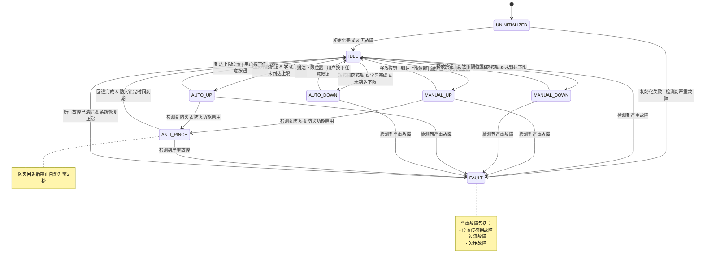

# Power Window Anti-Pinch Controller - State Machine Design

## Overview

The Power Window Anti-Pinch Controller implements a comprehensive state machine with 8 distinct states to manage window operation modes, safety conditions, and fault handling. This document provides detailed state machine design including state definitions, transition conditions, and behavioral specifications.

## State Machine Architecture

### State Definitions

The system operates in one of 8 mutually exclusive states:

| State ID | State Name | Description |
|----------|------------|-------------|
| 0 | UNINITIALIZED | System startup state, waiting for initialization |
| 1 | IDLE | Ready state, can accept new commands |
| 2 | MANUAL_UP | Manual upward movement (button held) |
| 3 | MANUAL_DOWN | Manual downward movement (button held) |
| 4 | AUTO_UP | Automatic upward movement (one-touch) |
| 5 | AUTO_DOWN | Automatic downward movement (one-touch) |
| 6 | ANTI_PINCH | Anti-pinch protection active, executing retract |
| 7 | FAULT | System fault state, all movement disabled |

### State Machine Diagram



## State Descriptions

### 1. UNINITIALIZED State

**Purpose**: System startup and initialization state.

**Entry Conditions**:
- System power-on reset
- System restart

**Behavior**:
- All outputs disabled
- Initialize all subsystems
- Load calibration parameters
- Load data from NVM
- Perform self-tests

**Exit Conditions**:
- **To IDLE**: Initialization successful AND no active faults
- **To FAULT**: Initialization failed OR critical fault detected

**Timeout**: Maximum 100ms for initialization

---

### 2. IDLE State

**Purpose**: Ready state where system can accept new commands.

**Entry Conditions**:
- Successful initialization from UNINITIALIZED
- Command completion from any movement state
- Fault recovery from FAULT state

**Behavior**:
- Motor stopped
- Monitor all inputs
- Accept new movement commands
- Perform background diagnostics

**Exit Conditions**:
- **To MANUAL_UP**: Button UP pressed AND position < upper limit
- **To MANUAL_DOWN**: Button DOWN pressed AND position > lower limit  
- **To AUTO_UP**: Button UP held > trigger time AND learning complete AND position < upper limit
- **To AUTO_DOWN**: Button DOWN held > trigger time AND learning complete AND position > lower limit
- **To FAULT**: Critical fault detected

**Special Conditions**:
- Learning procedure can be triggered only in this state
- Anti-pinch lockout timer expires in this state

---

### 3. MANUAL_UP State

**Purpose**: Manual upward window movement while button is held.

**Entry Conditions**:
- From IDLE: Button UP pressed AND position < upper limit

**Behavior**:
- Drive motor upward
- Monitor button state continuously
- Monitor position sensor
- Monitor anti-pinch conditions
- Update position every 10ms

**Exit Conditions**:
- **To IDLE**: Button released OR position ≥ upper limit
- **To ANTI_PINCH**: Current > anti-pinch threshold AND anti-pinch enabled
- **To FAULT**: Critical fault detected

**Safety Features**:
- Anti-pinch monitoring active
- Position limit enforcement
- Current monitoring

---

### 4. MANUAL_DOWN State

**Purpose**: Manual downward window movement while button is held.

**Entry Conditions**:
- From IDLE: Button DOWN pressed AND position > lower limit

**Behavior**:
- Drive motor downward
- Monitor button state continuously
- Monitor position sensor
- Update position every 10ms

**Exit Conditions**:
- **To IDLE**: Button released OR position ≤ lower limit
- **To FAULT**: Critical fault detected

**Safety Features**:
- Position limit enforcement
- Current monitoring (no anti-pinch in down direction)

---

### 5. AUTO_UP State

**Purpose**: Automatic upward movement (one-touch operation).

**Entry Conditions**:
- From IDLE: Button UP held > trigger time AND learning complete AND position < upper limit

**Behavior**:
- Drive motor upward continuously
- Monitor for user interruption
- Monitor anti-pinch conditions
- Continue until upper limit reached

**Exit Conditions**:
- **To IDLE**: Position ≥ upper limit OR any button pressed
- **To ANTI_PINCH**: Current > anti-pinch threshold AND anti-pinch enabled
- **To FAULT**: Critical fault detected

**Special Features**:
- User can interrupt by pressing any button
- Anti-pinch protection active
- Requires completed learning

---

### 6. AUTO_DOWN State

**Purpose**: Automatic downward movement (one-touch operation).

**Entry Conditions**:
- From IDLE: Button DOWN held > trigger time AND learning complete AND position > lower limit

**Behavior**:
- Drive motor downward continuously
- Monitor for user interruption
- Continue until lower limit reached

**Exit Conditions**:
- **To IDLE**: Position ≤ lower limit OR any button pressed
- **To FAULT**: Critical fault detected

**Special Features**:
- User can interrupt by pressing any button
- Requires completed learning

---

### 7. ANTI_PINCH State

**Purpose**: Execute anti-pinch protection sequence.

**Entry Conditions**:
- From MANUAL_UP: Current > anti-pinch threshold
- From AUTO_UP: Current > anti-pinch threshold

**Behavior**:
- Immediately stop upward movement
- Drive motor downward for retract distance
- Record anti-pinch event
- Start 5-second lockout timer

**Exit Conditions**:
- **To IDLE**: Retract distance completed AND lockout timer expired
- **To FAULT**: Critical fault detected during retract

**Special Features**:
- Automatic upward movement disabled for 5 seconds after exit
- Event logged for diagnostics
- Retract distance configurable (50-200mm)

---

### 8. FAULT State

**Purpose**: System fault state with all movement disabled.

**Entry Conditions**:
- From any state: Critical fault detected

**Critical Faults**:
- Position sensor fault (0x0001)
- Overcurrent fault (0x0002)
- Undervoltage fault (0x0004)

**Behavior**:
- All motor movement disabled
- Fault codes recorded
- Diagnostic data available
- Monitor fault conditions for recovery

**Exit Conditions**:
- **To IDLE**: All critical faults cleared AND system recovery confirmed

**Recovery Process**:
1. Monitor fault conditions
2. Wait for fault clearance
3. Verify system integrity
4. Resume normal operation

## State Transition Conditions

### Detailed Transition Matrix

| From State | To State | Condition | Priority |
|------------|----------|-----------|----------|
| UNINITIALIZED | IDLE | Init complete & No faults | 1 |
| UNINITIALIZED | FAULT | Init failed \| Critical fault | 1 |
| IDLE | MANUAL_UP | Button UP & Pos < Upper | 2 |
| IDLE | MANUAL_DOWN | Button DOWN & Pos > Lower | 2 |
| IDLE | AUTO_UP | Button UP > Trigger & Learn OK & Pos < Upper | 3 |
| IDLE | AUTO_DOWN | Button DOWN > Trigger & Learn OK & Pos > Lower | 3 |
| MANUAL_UP | IDLE | Button released \| Pos ≥ Upper | 2 |
| MANUAL_UP | ANTI_PINCH | Current > Threshold & Anti-pinch ON | 1 |
| MANUAL_DOWN | IDLE | Button released \| Pos ≤ Lower | 2 |
| AUTO_UP | IDLE | Pos ≥ Upper \| Button pressed | 2 |
| AUTO_UP | ANTI_PINCH | Current > Threshold & Anti-pinch ON | 1 |
| AUTO_DOWN | IDLE | Pos ≤ Lower \| Button pressed | 2 |
| ANTI_PINCH | IDLE | Retract complete & Lockout expired | 2 |
| ANY | FAULT | Critical fault detected | 1 |
| FAULT | IDLE | All faults cleared | 2 |

**Priority**: 1 = Highest (Safety), 2 = Normal, 3 = Lowest

### Condition Definitions

#### Button Conditions
- **Button UP**: `buttonState == POWERWINDOW_BUTTON_UP`
- **Button DOWN**: `buttonState == POWERWINDOW_BUTTON_DOWN`
- **Button released**: `buttonState == POWERWINDOW_BUTTON_RELEASED`
- **Button pressed**: `buttonState != POWERWINDOW_BUTTON_RELEASED`
- **Button UP > Trigger**: `buttonState == POWERWINDOW_BUTTON_UP && buttonPressTime > autoModeTriggerTime`

#### Position Conditions
- **Pos < Upper**: `currentPosition < positionUpperLimit`
- **Pos > Lower**: `currentPosition > positionLowerLimit`
- **Pos ≥ Upper**: `currentPosition >= positionUpperLimit`
- **Pos ≤ Lower**: `currentPosition <= positionLowerLimit`

#### Safety Conditions
- **Current > Threshold**: `motorCurrent > antiPinchCurrentThreshold`
- **Anti-pinch ON**: `antiPinchEnabled == POWERWINDOW_TRUE`
- **Learn OK**: `learnState == POWERWINDOW_LEARN_COMPLETED`

#### Fault Conditions
- **Critical fault**: Position sensor fault OR Overcurrent fault OR Undervoltage fault
- **No faults**: No active critical faults
- **All faults cleared**: All fault conditions resolved

## State Transition Examples

### Example 1: Manual Window Up Operation

```
Initial State: IDLE
User Action: Press and hold UP button
Position: 50% (2048/4095)

Transition Sequence:
1. IDLE → MANUAL_UP (Button UP pressed & Pos < Upper)
2. Motor drives upward, position increases
3. User releases button at 75% position
4. MANUAL_UP → IDLE (Button released)
```

### Example 2: Auto Window Up with Anti-Pinch

```
Initial State: IDLE
User Action: Short press UP button (600ms)
Position: 30% (1228/4095)
Learning: Completed

Transition Sequence:
1. IDLE → AUTO_UP (Button UP > 500ms & Learn OK & Pos < Upper)
2. Motor drives upward automatically
3. At 80% position, current spikes to 15A (threshold: 10A)
4. AUTO_UP → ANTI_PINCH (Current > Threshold & Anti-pinch ON)
5. Motor retracts 100mm downward
6. ANTI_PINCH → IDLE (Retract complete & 5s lockout expired)
```

### Example 3: Fault Recovery

```
Initial State: MANUAL_UP
Condition: System voltage drops to 8.5V (threshold: 10V)

Transition Sequence:
1. MANUAL_UP → FAULT (Undervoltage fault detected)
2. Motor stops immediately
3. Fault code 0x0004 recorded
4. System monitors voltage
5. Voltage recovers to 12V for 500ms
6. FAULT → IDLE (All faults cleared)
```

## State Machine Implementation

### State Machine Structure

```c
typedef struct {
    PowerWindow_SystemStateType currentState;
    PowerWindow_SystemStateType previousState;
    uint32_t stateEntryTime;
    uint32_t antiPinchLockoutTimer;
    PowerWindow_BoolType antiPinchLockoutActive;
    uint32_t stateTransitionCount;
} PowerWindow_StateMachineDataType;
```

### State Transition Function

```c
void PowerWindow_StateMachine_Update(const PowerWindow_RuntimeDataType* runtimeData)
{
    PowerWindow_SystemStateType nextState = currentState;
    
    /* Priority 1: Safety transitions (highest priority) */
    if (PowerWindow_Safety_CheckFaults()) {
        nextState = POWERWINDOW_STATE_FAULT;
    }
    else if (currentState == POWERWINDOW_STATE_MANUAL_UP || 
             currentState == POWERWINDOW_STATE_AUTO_UP) {
        if (PowerWindow_Safety_MonitorAntiPinch(runtimeData->motorCurrent, 
                                                 currentState, 
                                                 calibParams.antiPinchCurrentThreshold)) {
            nextState = POWERWINDOW_STATE_ANTI_PINCH;
        }
    }
    
    /* Priority 2: Normal state transitions */
    if (nextState == currentState) {
        switch (currentState) {
            case POWERWINDOW_STATE_UNINITIALIZED:
                if (initializationComplete && !PowerWindow_Safety_HasActiveFault()) {
                    nextState = POWERWINDOW_STATE_IDLE;
                }
                break;
                
            case POWERWINDOW_STATE_IDLE:
                if (runtimeData->buttonState == POWERWINDOW_BUTTON_UP && 
                    runtimeData->currentPosition < calibParams.positionUpperLimit) {
                    if (runtimeData->buttonPressTime > calibParams.autoModeTriggerTime &&
                        runtimeData->learnState == POWERWINDOW_LEARN_COMPLETED) {
                        nextState = POWERWINDOW_STATE_AUTO_UP;
                    } else {
                        nextState = POWERWINDOW_STATE_MANUAL_UP;
                    }
                }
                /* ... other transitions ... */
                break;
                
            /* ... other states ... */
        }
    }
    
    /* Execute state transition */
    if (nextState != currentState) {
        PowerWindow_StateMachine_ExecuteTransition(nextState);
    }
}
```

### State Entry/Exit Actions

#### State Entry Actions

| State | Entry Actions |
|-------|---------------|
| UNINITIALIZED | Reset all timers, disable outputs |
| IDLE | Stop motor, reset button timer |
| MANUAL_UP | Start motor up, reset position timer |
| MANUAL_DOWN | Start motor down, reset position timer |
| AUTO_UP | Start motor up, set auto mode flag |
| AUTO_DOWN | Start motor down, set auto mode flag |
| ANTI_PINCH | Stop motor, start retract, log event |
| FAULT | Stop motor, record fault codes |

#### State Exit Actions

| State | Exit Actions |
|-------|--------------|
| UNINITIALIZED | Clear initialization flags |
| IDLE | Clear command flags |
| MANUAL_UP | Stop motor |
| MANUAL_DOWN | Stop motor |
| AUTO_UP | Stop motor, clear auto mode flag |
| AUTO_DOWN | Stop motor, clear auto mode flag |
| ANTI_PINCH | Start lockout timer |
| FAULT | Clear recoverable faults |

## Timing Requirements

### State Timing Constraints

| Timing Parameter | Value | Description |
|------------------|-------|-------------|
| Initialization Timeout | 100ms | Maximum time for system initialization |
| Auto Trigger Time | 300-1000ms | Button hold time for auto mode (configurable) |
| Anti-Pinch Lockout | 5000ms | Auto mode disabled after anti-pinch |
| Fault Debounce | 100-200ms | Fault condition persistence time |
| Position Update Rate | 10ms | Position sensor reading frequency |
| State Machine Update | 10ms | State machine evaluation frequency |

### Performance Metrics

- **State Transition Time**: < 1ms
- **Fault Response Time**: < 10ms
- **Anti-Pinch Response Time**: < 20ms
- **Position Accuracy**: ±1% of full range

## Diagnostic and Monitoring

### State Transition Logging

Each state transition is logged with:
- Timestamp
- Source state
- Target state
- Trigger condition
- System context (position, current, voltage)

### State Machine Diagnostics

Available diagnostic data:
- Current state
- Previous state
- State entry time
- Total transition count
- Fault transition count
- Anti-pinch event count

### Debug Interface

```c
/* Diagnostic functions */
PowerWindow_SystemStateType PowerWindow_StateMachine_GetState(void);
PowerWindow_SystemStateType PowerWindow_StateMachine_GetPreviousState(void);
uint32_t PowerWindow_StateMachine_GetStateTime(void);
uint32_t PowerWindow_StateMachine_GetTransitionCount(void);
```

## Validation and Testing

### State Coverage Testing

All states must be tested:
- Entry conditions verified
- Behavior validated
- Exit conditions confirmed
- Timing requirements met

### Transition Coverage Testing

All valid transitions must be tested:
- Normal operation paths
- Fault injection scenarios
- Edge case conditions
- Recovery sequences

### Property-Based Testing

State machine properties to verify:
- **Safety**: Critical faults always lead to FAULT state
- **Liveness**: System can always reach IDLE from any state
- **Determinism**: Same inputs produce same transitions
- **Timing**: All timing constraints are met

## Version History

- **v1.0.0** - Initial state machine design
- Current implementation supports all 8 states with complete transition logic

---

**Document Version**: 1.0.0  
**Last Updated**: 2024  
**Status**: Implementation Complete